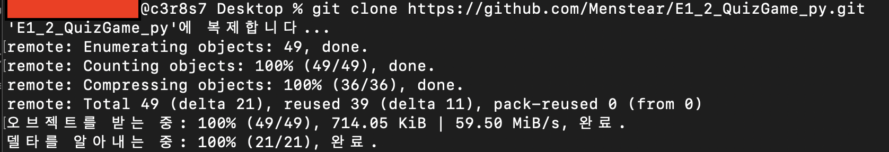
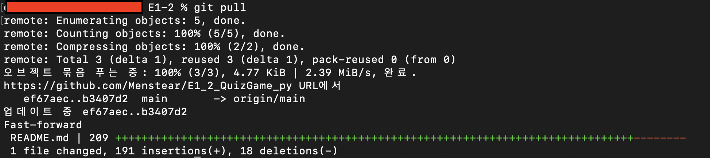
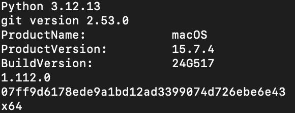
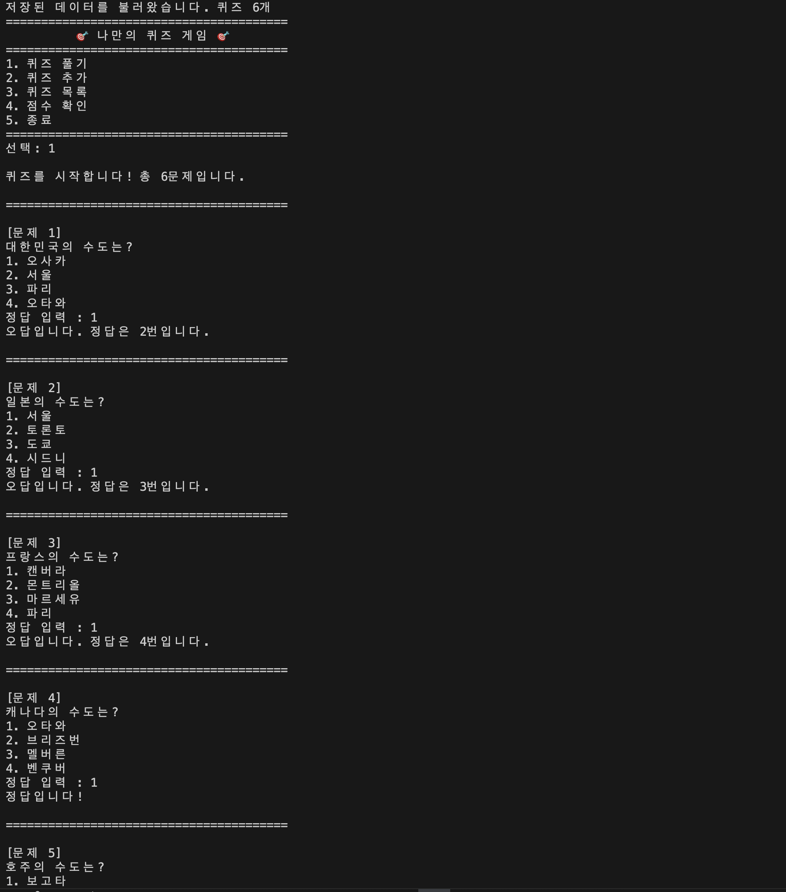
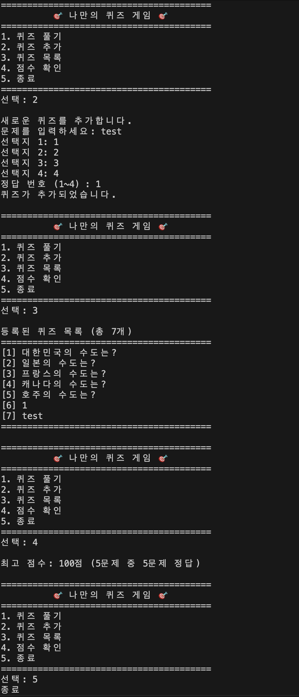
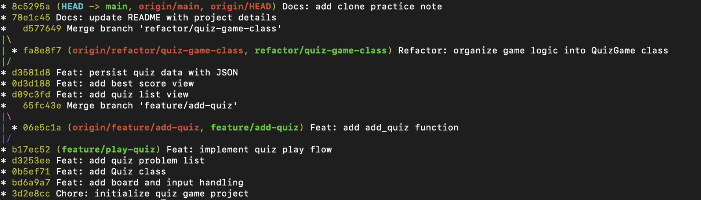

# 세계 수도 퀴즈 게임

## 프로젝트 개요

이 프로젝트는 Python으로 구현한 콘솔 기반 4지선다형 퀴즈 게임입니다.

사용자는 터미널에서 메뉴를 선택하여 퀴즈를 풀고, 새로운 퀴즈를 추가하고, 등록된 퀴즈 목록을 확인하며, 최고 점수를 볼 수 있습니다.

프로그램은 `state.json` 파일을 사용하여 퀴즈 데이터와 최고 점수를 저장합니다. 따라서 프로그램을 종료한 뒤 다시 실행해도 추가한 퀴즈와 최고 점수가 유지됩니다.

## 퀴즈 주제 선정 이유

퀴즈 주제는 각 나라의 수도입니다.

나라별 수도는 기본 상식으로 접하기 쉽고, 4지선다형 문제로 구성하기 적합하다고 생각했습니다. 또한 여러 나라의 수도를 맞히는 과정에서 자연스럽게 세계 지리에 대한 관심도 높일 수 있어 이 주제를 선택했습니다.

## 개발 환경

- Python 3.12.13
- Git 2.53.0
- macOS 15.7.4
- VSCode 1.112.0
- GitHub Repository: `E1_2_QuizGame_py`

## 실행 방법

프로젝트 폴더에서 아래 명령어를 실행합니다.

```bash
python3 main.py
```

또는 환경에 따라 아래 명령어를 사용할 수 있습니다.

```bash
python main.py
```

## 기능 목록

### 1. 퀴즈 풀기

저장된 퀴즈를 순서대로 풀 수 있습니다.  
각 문제는 4개의 선택지를 가지고 있으며, 사용자는 1~4 중 하나를 입력해 정답을 선택합니다.

### 2. 퀴즈 추가

사용자가 직접 새로운 퀴즈를 추가할 수 있습니다.

입력 항목은 다음과 같습니다.

- 문제
- 선택지 4개
- 정답 번호

추가한 퀴즈는 `state.json`에 저장되어 프로그램을 다시 실행해도 유지됩니다.

### 3. 퀴즈 목록 확인

현재 등록된 퀴즈 목록을 확인할 수 있습니다.  
각 퀴즈의 문제 문장이 번호와 함께 출력됩니다.

### 4. 점수 확인

퀴즈를 푼 뒤 최고 점수를 확인할 수 있습니다.  
기존 최고 점수보다 높은 점수를 받으면 최고 점수가 갱신됩니다.

`best_total`은 최고 점수를 기록했을 당시의 전체 문제 수를 의미합니다.  
따라서 퀴즈를 새로 추가하더라도 과거 최고 점수 기록의 문제 수는 당시 기준으로 유지됩니다.

### 5. 종료

프로그램을 안전하게 종료합니다.  
종료 시 현재 데이터를 `state.json`에 저장합니다.

## 예외 처리

다음과 같은 잘못된 입력을 처리합니다.

- 빈 입력
- 숫자가 아닌 입력
- 허용 범위를 벗어난 숫자
- 메뉴 선택 범위 초과
- 정답 번호 범위 초과
- `Ctrl+C` 입력
- 입력 스트림 종료
- `state.json` 파일 없음
- `state.json` 파일 손상

## 파일 구조

```text
E1-2/
├── main.py
├── state.json
├── README.md
├── .gitignore
└── screenshots/
    ├── environment_versions.png
    ├── play_quiz.png
    ├── add_list_score.png
    ├── git_log_graph.png
    ├── git_clone_result.png
    ├── git_clone_commit_push.png
    └── git_pull_result.png
```

## 주요 파일 설명

### `main.py`

퀴즈 게임의 전체 코드가 들어 있는 파일입니다.

주요 클래스는 다음과 같습니다.

- `Quiz`: 개별 퀴즈를 표현하는 클래스
- `QuizGame`: 게임 전체 흐름을 관리하는 클래스

`QuizGame` 클래스는 메뉴 출력, 입력 처리, 퀴즈 풀기, 퀴즈 추가, 목록 확인, 점수 확인, 저장 및 불러오기 기능을 담당합니다.

### `state.json`

퀴즈 데이터와 최고 점수를 저장하는 JSON 파일입니다.  
프로젝트 루트에 위치합니다.

예시 구조는 다음과 같습니다.

```json
{
    "quizzes": [
        {
            "question": "대한민국의 수도는?",
            "choices": ["오사카", "서울", "파리", "오타와"],
            "answer": 2
        }
    ],
    "best_score": 3,
    "best_total": 5
}
```

각 필드의 의미는 다음과 같습니다.

- `quizzes`: 저장된 퀴즈 목록
- `question`: 문제
- `choices`: 4개의 선택지
- `answer`: 정답 번호
- `best_score`: 최고 정답 개수
- `best_total`: 최고 점수를 기록했을 때의 전체 문제 수

## JSON 선택 이유

이 프로젝트에서는 퀴즈 데이터와 최고 점수를 저장하기 위해 JSON 형식을 사용했습니다.

JSON은 사람이 읽고 수정하기 쉬운 텍스트 기반 구조이며, 파일 크기가 비교적 가볍습니다. 또한 Python뿐 아니라 JavaScript, Java 등 여러 언어에서 쉽게 사용할 수 있어 교차 언어 호환성이 좋습니다.

다만 데이터가 매우 많아지면 검색 성능이나 부분 수정에는 한계가 있으므로, 대량 데이터를 다룰 경우 데이터베이스 사용을 고려할 수 있습니다.

## 클래스 사용 이유

이 프로젝트에서는 `Quiz`와 `QuizGame` 클래스를 사용하여 역할을 분리했습니다.

`Quiz` 클래스는 문제, 선택지, 정답처럼 퀴즈 하나에 필요한 데이터를 관리합니다.  
`QuizGame` 클래스는 퀴즈 목록, 최고 점수, 메뉴 흐름, 저장 및 불러오기 등 게임 전체 상태를 관리합니다.

함수만 사용하는 방식은 간단한 프로그램에서는 작성하기 쉽지만, 데이터와 기능이 많아질수록 전역 변수 관리가 복잡해질 수 있습니다. 반면 클래스는 관련 데이터와 기능을 하나로 묶을 수 있어 상태 관리와 코드 재사용에 유리합니다.

| 구분 | 함수 기반 방식 | 클래스 기반 방식 |
|---|---|---|
| 장점 | 구조가 단순하고 처음 작성하기 쉽다 | 데이터와 기능을 함께 관리하기 좋다 |
| 단점 | 전역 변수가 많아지면 관리가 어렵다 | 처음에는 `self`, 객체 개념이 필요하다 |
| 이 프로젝트 적용 | 단순한 입력 처리 함수에 적합 | 퀴즈 목록, 점수, 저장 상태 관리에 적합 |

## 데이터 백업 및 복구 절차

이 프로젝트의 주요 데이터는 프로젝트 루트의 `state.json` 파일에 저장됩니다.

### 정기 백업

퀴즈 데이터 손실을 방지하기 위해 작업 후 GitHub에 주기적으로 push합니다.

```bash
git status
git add .
git commit -m "Docs: update project documentation"
git push
```

필요한 경우 `state.json` 파일을 별도 백업 파일로 복사할 수 있습니다.

```bash
cp state.json state_backup.json
```

### 임시 파일 저장

테스트 중 임시 데이터가 필요한 경우 `state_backup.json` 또는 `state_test.json`처럼 별도 파일을 만들어 보관할 수 있습니다.

단, 실제 프로그램은 기본적으로 프로젝트 루트의 `state.json`만 읽고 씁니다.

### 복구 또는 초기화 절차

`state.json`이 손상되었거나 초기 상태로 되돌리고 싶다면, 먼저 기존 파일을 백업한 뒤 삭제합니다.

```bash
cp state.json state_backup.json
rm state.json
python3 main.py
```

프로그램은 `state.json` 파일이 없을 경우 기본 퀴즈 데이터를 사용하여 실행됩니다.  
또한 JSON 파일이 손상된 경우에도 오류 메시지를 출력하고 기본 퀴즈 데이터로 실행되도록 예외 처리를 구현했습니다.

## 대량 데이터 확장 시 고려사항

현재 프로그램은 콘솔 기반 학습용 퀴즈 게임이며, 기본적으로 소규모 퀴즈 데이터를 기준으로 설계되었습니다.

퀴즈가 1000개 이상으로 증가하면 다음과 같은 한계가 발생할 수 있습니다.

- 모든 퀴즈를 한 번에 메모리에 불러오기 때문에 메모리 사용량이 증가할 수 있음
- 퀴즈 목록 출력 시 한 화면에 너무 많은 데이터가 표시되어 가독성이 떨어짐
- 특정 문제를 검색하거나 수정하는 기능이 없어서 관리가 어려움
- JSON 파일 전체를 읽고 쓰기 때문에 데이터가 커질수록 저장/불러오기 시간이 늘어날 수 있음

이를 개선하기 위한 방법은 다음과 같습니다.

- 퀴즈 목록을 일정 개수씩 나누어 보여주는 페이징 기능 추가
- 문제 제목이나 국가명으로 검색하는 기능 추가
- 자주 찾는 데이터에 인덱스를 두어 검색 속도 개선
- 데이터가 더 커질 경우 SQLite 같은 데이터베이스로 전환
- 전체 파일 저장 방식 대신 변경된 데이터만 저장하는 방식 고려

## Git 작업 기록

이 프로젝트는 Git을 사용하여 기능 단위로 커밋을 나누어 관리했습니다.

사용한 주요 Git 명령어는 다음과 같습니다.

```bash
git init
git add
git commit
git push
git checkout
git merge
git clone
git pull
```

브랜치를 생성하여 기능을 개발한 뒤 `main` 브랜치로 병합했습니다.

예시 브랜치:

- `feature/play-quiz`
- `feature/add-quiz`
- `refactor/quiz-game-class`

## 커밋 메시지 규칙

이 프로젝트에서는 커밋 메시지를 기능 단위로 작성했습니다.

기본 형식은 다음과 같습니다.

```text
Prefix: 변경 내용 요약
```

사용한 주요 Prefix는 다음과 같습니다.

| Prefix | 의미 | 예시 |
|---|---|---|
| `Feat` | 새로운 기능 추가 | `Feat: add quiz list view` |
| `Fix` | 오류 수정 | `Fix: clarify best score display` |
| `Docs` | 문서 수정 | `Docs: update README with project details` |
| `Refactor` | 기능 변화 없는 코드 구조 개선 | `Refactor: organize game logic into QuizGame class` |
| `Chore` | 초기 설정 또는 기타 작업 | `Chore: initialize quiz game project` |

필요한 경우 본문을 추가하여 변경 이유를 설명할 수 있습니다.

```text
Feat: add quiz creation feature

- 사용자가 문제와 선택지 4개를 입력할 수 있도록 구현
- 정답 번호는 1~4 사이로 검증
```

이슈 번호가 있는 프로젝트라면 다음과 같이 참조할 수 있습니다.

```text
Fix: handle broken state file

Closes #3
```

## Git clone 및 pull 실습 기록

퀴즈 게임 개발을 완료한 뒤, GitHub 원격 저장소를 별도의 로컬 디렉터리에 복제하여 `clone`과 `pull` 명령어를 실습했습니다.

### 1. 저장소 복제

```bash
cd ~/Desktop
git clone https://github.com/Menstear/E1_2_QuizGame_py.git E1_2_clone_capture
```

### 2. 복제한 저장소에서 README 수정 후 push

```bash
cd E1_2_clone_capture
git add README.md
git commit -m "Docs: document project operation and scaling"
git push
```

### 3. 기존 작업 디렉터리에서 pull

```bash
cd ~/Desktop/E1-2
git pull
```

`pull` 실행 결과, 복제 저장소에서 수정한 README 변경사항이 기존 작업 디렉터리에 반영되었습니다.

### clone/pull 실습 스크린샷

`git clone` 실행 결과입니다.




기존 작업 디렉터리에서 `git pull`을 수행한 결과입니다.



## 실행 예시

```text
========================================
          🎯 나만의 퀴즈 게임 🎯
========================================
1. 퀴즈 풀기
2. 퀴즈 추가
3. 퀴즈 목록
4. 점수 확인
5. 종료
========================================
선택:
```

## 실행 결과 스크린샷

개발 환경 버전 확인 화면입니다.



퀴즈 풀이 화면입니다.



퀴즈 추가, 목록 확인, 점수 확인 화면입니다.



Git 커밋 로그 그래프 화면입니다.



## 기본 퀴즈 예시

기본으로 포함된 퀴즈는 다음과 같습니다.

- 대한민국의 수도
- 일본의 수도
- 프랑스의 수도
- 캐나다의 수도
- 호주의 수도

## 배운 점

이 프로젝트를 통해 Python의 기본 문법, 클래스, 파일 입출력, JSON 저장 방식, 예외 처리, Git 브랜치 작업을 연습했습니다.

특히 `Quiz`와 `QuizGame` 클래스를 나누어 작성하면서 객체 지향 구조를 이해할 수 있었고, `state.json`을 사용하여 프로그램 종료 후에도 데이터가 유지되는 방식을 경험했습니다.

또한 Git을 사용해 기능 단위로 커밋하고, 브랜치를 생성한 뒤 병합하고, GitHub 원격 저장소에서 clone과 pull을 실습했습니다.
